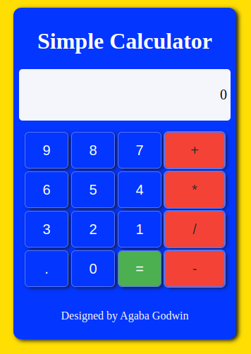

# JavaScript Calculator 🧮

Welcome to the JavaScript Calculator repository! This project showcases a fully functional calculator built using HTML, CSS, and JavaScript. Whether you're a coding enthusiast or just curious about web development, this calculator provides a hands-on example of how these technologies come together to create an interactive user experience.



## 🚀 Features

- Basic arithmetic operations: addition, subtraction, multiplication, and division.
- Responsive design that adapts to various screen sizes, including mobile devices.
- Clear and intuitive user interface for seamless interaction.
- JavaScript logic for handling calculations and updating the display in real time.
- Stylish CSS for a visually appealing look and feel.

## 📂 Repository Structure

- `index.html`: The main HTML file containing the calculator's structure.
- `styles.css`: Cascading Style Sheets defining the visual design of the calculator.
- `script.js`: JavaScript code responsible for the calculator's functionality.
- `assets/`: Folder containing any additional assets, such as images or icons.

## 🤝 Contribution
Contributions are welcome! If you'd like to enhance the calculator's features, improve its design, or fix any issues, please submit a pull request. Let's learn and grow together!

## 📬 Contact
Got questions or suggestions? Feel free to reach out to us through Twitter.
Happy coding! 🚀
<div id="badges" align="start">
  <a href="https://www.linkedin.com/in/godwin-agaba-187489286/">
    
  </a>
  <a href="your-youtube-URL">
    
  </a>
  <a href="https://twitter.com/god_wini">
    
  </a>
</div>

## 🔧 Usage

1. Clone or fork this repository to your local machine.
2. Open `index.html` in your preferred browser.
3. Start crunching numbers with the JavaScript Calculator!

```bash
git clone https://github.com/yourusername/javascript-calculator.git
cd javascript-calculator
open index.html
